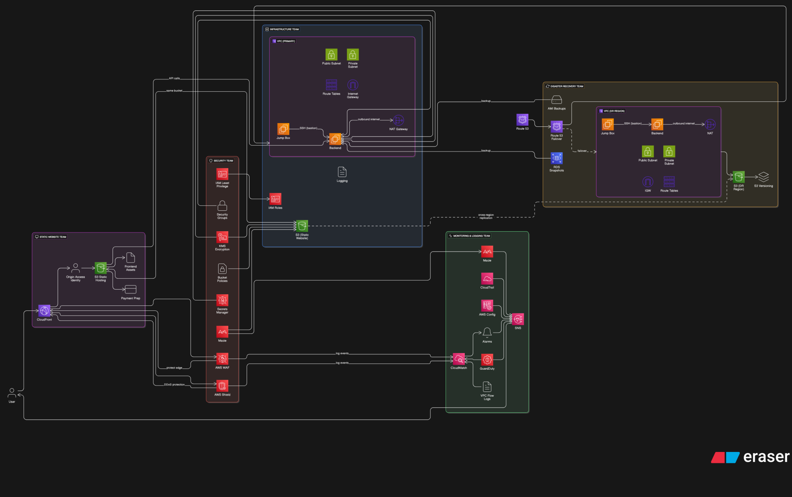
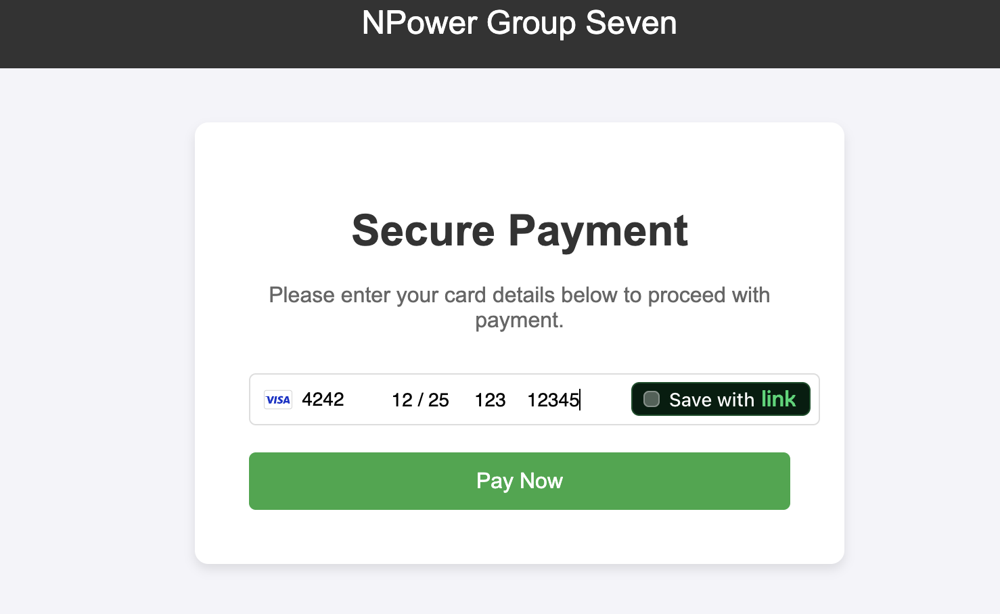

# AWS Financial Platform Security & Disaster Recovery
### [System Architecture Diagram:](https://app.eraser.io/workspace/haSxO9jPHL94zgbhB0Hh?origin=share)

### [Website:](https://group7-static-website.s3.us-east-2.amazonaws.com/index.html)

## Team:

## [Google Doc](https://docs.google.com/document/d/1tVQUJNV1JQDyi1gsuUL4mkZLNrDxdhy8GNTV5netxkg/edit?usp=sharing)
## Overview
This project provides a comprehensive, modular Infrastructure as Code (IaC) solution using Terraform to secure and manage a public-facing financial services web application on AWS. It implements best practices for security, monitoring, alerting, and disaster recovery, ensuring high availability, rapid threat detection, and robust data protection.

## Features
- **AWS WAF & CloudFront Integration**: Protects the static website with managed rules (IP reputation, anonymous IP, OWASP core rules) and custom threat blocks. CloudFront serves as a secure CDN with S3 origin access identity.
- **S3 Static Website**: Secure, private S3 bucket for static site hosting, accessible only via CloudFront.
- **GuardDuty & Macie**: Continuous threat detection and sensitive data discovery/classification in S3.
- **CloudWatch & SNS**: Real-time monitoring, anomaly detection, and alerting for 4xx/5xx/DDoS events, with instant notifications to email.
- **Secrets Manager & KMS**: Secure credential storage and customer-managed encryption keys for backend resources.
- **IAM**: Least-privilege roles and policies for EC2, S3, Secrets Manager, and KMS.
- **Disaster Recovery (DR)**: S3 cross-region replication, RDS snapshot copy, and Route 53 DNS failover for high availability and business continuity.
- **VPC & EC2**: Secure network segmentation and backend compute resources.

## Architecture
- All critical AWS resources are modularized for reusability and clarity.
- Security controls are enforced at the edge (CloudFront + WAF) and at rest (S3, KMS, Secrets Manager).
- Monitoring and alerting are integrated for rapid response to incidents.
- DR plan ensures data and service availability across AWS regions.

## Modules
- `vpc/` - Core networking
- `s3-static-site/` - Static website hosting
- `cloudfront/` - CDN and edge security
- `waf/` - Web Application Firewall
- `ec2/` - Backend compute
- `iam/` - Identity and access management
- `guardduty/` - Threat detection
- `secrets-manager/` - Secure secrets storage
- `kms/` - Encryption keys
- `cloudwatch/` - Monitoring and alarms
- `sns/` - Notifications
- `macie/` - Sensitive data discovery
- `dr-replication/` - Disaster recovery
- `route53/` - DNS and failover

## Security & Compliance
- Aligned with AWS best practices and the OWASP Top 10.
- Automated, auditable, and repeatable deployments.
- Fine-grained access controls and encryption for sensitive data.

## Disaster Recovery
- S3 cross-region replication and RDS snapshot copy for data durability.
- Route 53 DNS failover for rapid recovery.
- Regular DR testing and monitoring recommended.